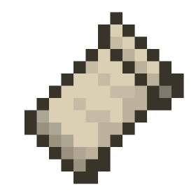

_Credits to the artist: @waik08bit_

  

<h1 align="center">
  Good day! My name is Ed, an aspiring programmer and artist. Pleased to be in your company.
</h1>

<h3>
  <a href="https://xx-ed1414-xx.github.io/portfolio">
    CLICK ME FOR FUN!
  </a>
</h3>

## 》EDUCATION

- **Polytechnic University of the Philippines — A. Mabini Campus**  
  Bachelor of Science in Information Technology (BSIT)  
  _2022 - 2026_

- **St. Lino Science High School**  
  Science, Technology, Engineering, and Mathematics (STEM) Track  
  _2016 - 2022_

## 》TECHNOLOGIES

### Languages

  

### Frameworks and Libraries

  
  

### Game Development and Modding

  
  

### Databases

  

### Operating Systems

  
  

### Development Tools

  

### Creative Tools

  

## 》RESUME

  

